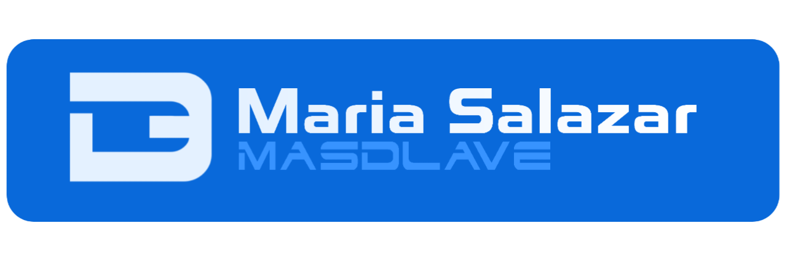
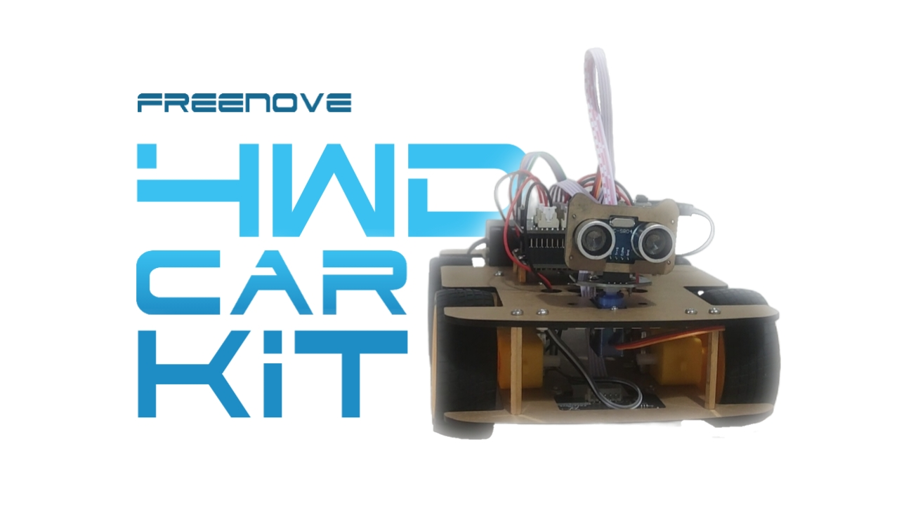

# Maria Salazar
> Desarrollo de Aplicaciones Multiplataforma

  
 Contenido relevante 

  <a href="#proyectos-destacados">Proyectos destacados</a> | <a href="#arduino-4wd-car-kit-timelapse">Arduino 4WD Car Kit timelapse</a> | 

**¡Saludos!** 📎 Estás leyendo la presentación de **Maria Salazar** (_@masdlave_). Me especializo en el **_desarrollo de código_**[^1] académica y profesionalmente, con un compromiso constante con el aprendizaje tanto individual como colectivo. Considero que una _buena práctica de programación_[^2] no solo requiere técnica, sino también una **actitud flexible y visionaria**. Trabajo constantemente en _estimular mi creatividad_; la dedicación, la precisión y un esfuerzo meticuloso en cada detalle **marcan la diferencia**.

- **Comunicación efectiva** en equipos multidisciplinarios.
- **Adaptabilidad** en entornos de aprendizaje continuos.
- Organización ágil en **resolución de problemas**.

[^1]: Ciclo Formativo de Grado Superior de Desarrollo de Aplicaciones Multiplataforma.
[^2]: Java ([IntelliJ IDEA](https://www.jetbrains.com/es-es/idea/)), HTML/CSS/Bootstrap ([VS Code](https://code.visualstudio.com)), software de virtualización con [VirtualBox](https://www.virtualbox.org), [MySQL Workbench](https://www.mysql.com/products/workbench/)...

[Telegram](https://t.me/masdlave) | [Github](https://github.com/masdlave) | <a href="https://masdlave.w3spaces.com"> <b>W3Schools</b> </a>

  
  
  
  
  
  
  

> [!NOTE]
> 

## Proyectos destacados

---

---

 
---
### Colaboradores

